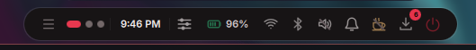
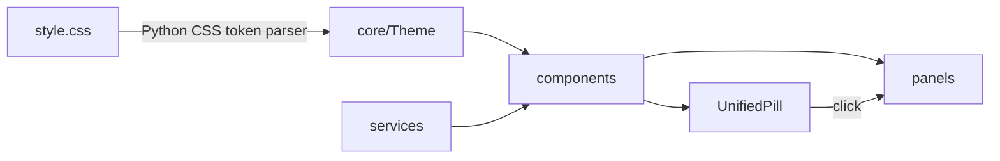

<div align="center">

# 🌌 Arch Linux Rice

### Custom Wayland shell components for **Hyprland + Quickshell**
*Radial launchers · status bars · control centers · whatever comes next*

<br>


<br>

**[🎯 Dail Launcher](#-dail-launcher)** &nbsp;•&nbsp;
**[🖥️ EssentialBar](#️-essentialbar)** &nbsp;•&nbsp;
**[💻 System](#-system)** &nbsp;•&nbsp;
**[🗂️ Structure](#️-repository-structure)**

</div>

---

## ✨ About

This started as a personal setup I never planned to share. A few people asked about it, so here it is.

Everything is **built from scratch in QML**, designed to be **customizable without touching source code**, and **tuned to stay light** on a mid-range laptop.

> 💬 Criticism welcomed. Advice welcomed. **Collaboration most welcomed.**

---

## 🧩 Components

<table>
<tr>
<td width="50%" valign="top">

### 🎯 Dail Launcher
A radial quick-launch wheel. Hotkey → hover or arrow to a slice → Enter → app launches, wheel closes.

**`QtQuick.Shapes`** · **daemon mode** · **hot-reload**

[📖 Full docs](./DailLauncher/README.md)

</td>
<td width="50%" valign="top">

### 🖥️ EssentialBar
An island-style status pill that expands into a full 6-tab control center.

**~110 MB at launch** · **9 services** · **live CSS theming**

[📖 Full docs](./EssentialBar/README.md)

</td>
</tr>
</table>

---

## 🎯 Dail Launcher

<div align="center">


</div>

Pop it open with a hotkey, hover or arrow-key to a slice, click or press **Enter**. The app launches and the wheel closes. Every slice maps to **any shell command you want**.

The wheel is a donut of evenly-divided arc segments rendered with `QtQuick.Shapes`. A center hub card mirrors the active slice, slices pop outward and glow on hover, and the whole thing springs open and shrinks closed with eased animations.

### Highlights

| | |
| :--- | :--- |
| 🔢 **Any number of slices** | The wheel divides 360° automatically |
| ⌨️ **Mouse + keyboard** | Hover, arrows, number keys, Enter, Esc |
| ⚡ **Daemon mode** | Stays resident between presses, reopens instantly |
| 🔥 **Live hot-reload** | Edit and save, the wheel updates without relaunch |
| 🚀 **Detached launching** | Launched apps outlive the wheel |
| 📦 **Zero extra dependencies** | One QML file, only Quickshell required |

### Customize without touching QML

| File | Controls |
| :--- | :--- |
| `rl_layout.json` | Cells (name, icon, script), ring geometry, typography, animations |
| `rl_theme.css` | Colors, scale, opacity, blur, dimness, per-layer transparency |

### Try it

```bash
cd DailLauncher
qs -p "round launcher.qml"
```

➜ **[Read the full Dail Launcher documentation](./DailLauncher/README.md)**

---

## 🖥️ EssentialBar

<div align="center">



</div>

A Hyprland status bar and control center built entirely in QML. A compact pill sits at the top of the screen showing workspaces, battery, Wi-Fi, Bluetooth, volume, DND state, and notification previews. Click it to open the full control panel.

Built to be functional without being bloated:

| Metric | Value |
| :--- | :--- |
| 🚀 At launch | **~110 MB** (Pss) |
| 📂 After opening all panels | **~145 MB** |
| 🔋 Polling | Services poll **only while the panel is open** |

### What the pill shows

- 🔵 **Workspace dots** with active highlight + window list
- 🕐 **Live clock** with calendar popup and media card
- 📡 **Status icons:** Wi-Fi signal, Bluetooth, volume, DND, caffeine, battery %, updates

### The 6-tab control panel

| Tab | What it does |
| :--- | :--- |
| 🏠 **Main** | Quick-toggle tiles + now-playing media card |
| 📶 **Wi-Fi** | Scan, connect, password entry, saved-password reveal, network details |
| 🦷 **Bluetooth** | Pair, connect, disconnect, forget, auto-pair |
| 🔊 **Sound** | Volume sliders, stereo balance, device + profile switching |
| 🧠 **System** | CPU / GPU / RAM / battery / fan stats, power profile selector |
| 🔔 **Alerts** | Notification history, per-app mute, action buttons |

### Under the hood



<details>
<summary><b>⚙️ Backend services (click to expand)</b></summary>

<br>

`AudioService` · `BluetoothService` · `NetworkService` · `SystemService` · `BrightnessService` · `NightLightService` · `MediaService` · `NotificationService` · `CaffeineService`

</details>

<details>
<summary><b>🎨 Theming (click to expand)</b></summary>

<br>

Everything lives in **`style.css`**: colors, spacing, radii, font, animation durations, icon colors. Edit and save, and the bar hot-reloads live via a Python CSS token parser.

</details>

➜ **[Read the full EssentialBar documentation](./EssentialBar/README.md)**

---

## 💻 System

| | |
| :--- | :--- |
| 💻 **Device** | HP Victus 15 fb0108ax |
| 🐧 **OS** | Arch Linux |
| 🪟 **WM** | Hyprland |
| ⌨️ **Terminal** | kitty 0.48.2 |
| 🖥️ **Display** | 1920×1080 @ 144Hz |
| 🧠 **CPU** | AMD Ryzen 5 5600H |
| 🎮 **GPU** | AMD Radeon RX 6500M + Radeon Vega (integrated) |
| 💾 **RAM** | 8 GB |
| 📀 **Storage** | 512 GB |

> ⚠️ Not tested on any other device or distro.

---

## 🗂️ Repository Structure

```
Arch-Linux-Rice/
├── README.md
│
├── DailLauncher/
│   ├── round launcher.qml     ← single-file radial launcher
│   ├── rl_theme.css           ← colors + effects
│   └── rl_layout.json         ← cells + geometry
│
├── EssentialBar/
│   ├── shell.qml              ← root: bar + clock popup + workspace polling
│   ├── style.css              ← design token source of truth
│   ├── run-lean.sh            ← memory-optimized launch script
│   ├── core/                  ← Theme, ShellState, CSS parser, icon generator
│   ├── services/              ← all backend singletons
│   ├── components/            ← reusable UI primitives + UnifiedPill
│   ├── panels/                ← ControlPanel + NotificationPanel
│   └── icons/                 ← generated Lucide SVG color variants (one per tone)
│
└── Preview/
    ├── DailLauncher/          ← screenshots + demo video
    └── EssentialBar/          ← screenshots + demo video
```

---

## 🛠️ Built With

[](https://quickshell.outfoxxed.me/)
[](https://hyprland.org/)


---

<div align="center">

### 🌱 More components on the way

If you build something with these, fork them, or just have thoughts, open an issue or a PR. 💛

</div>